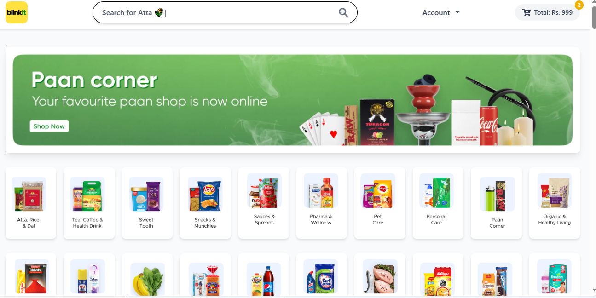
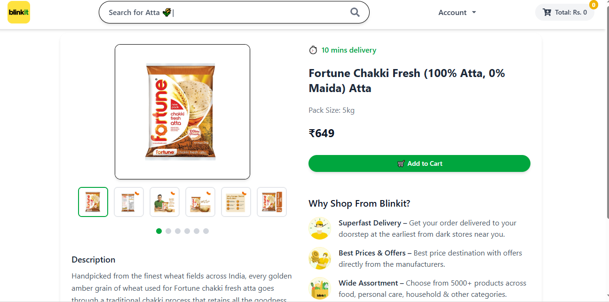
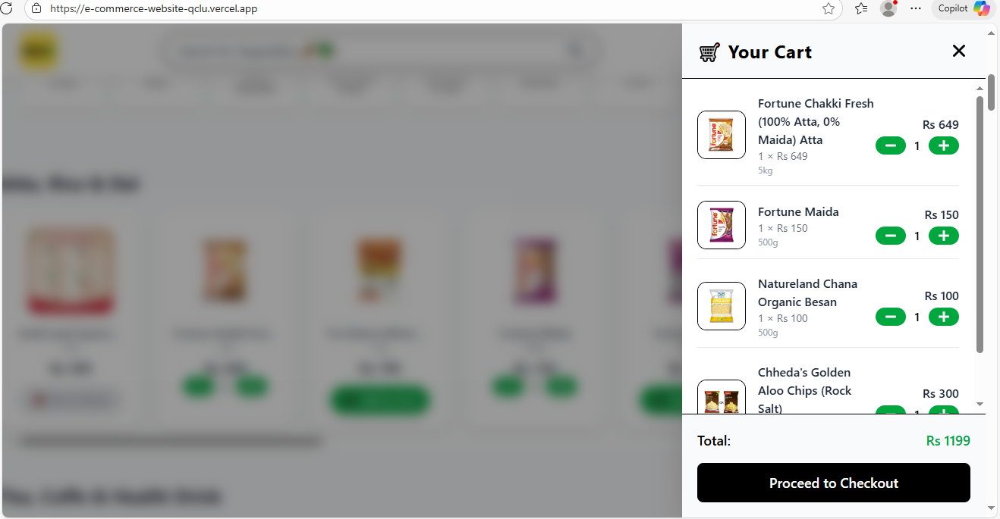
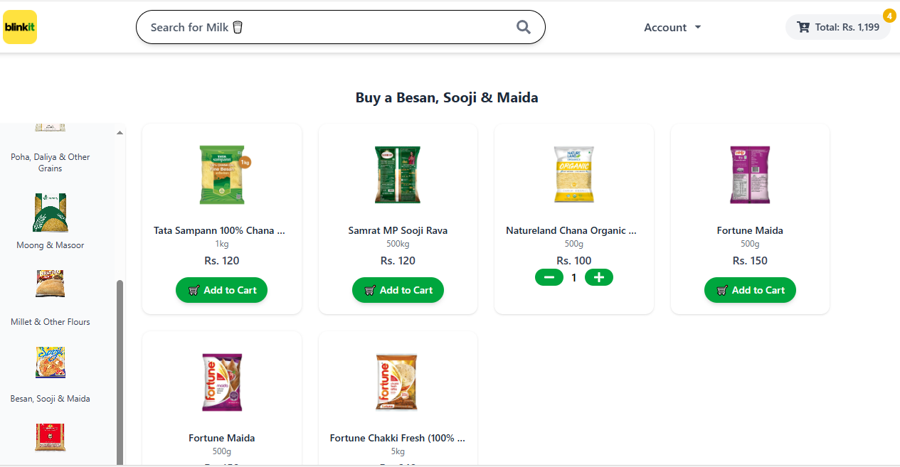
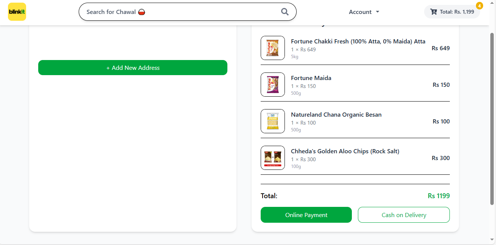
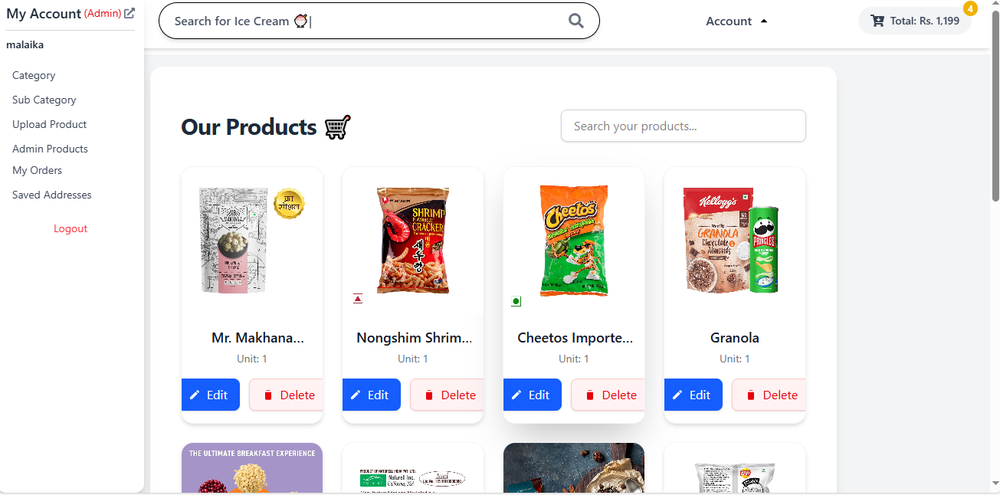

# 🛒 Blinkit Clone (MERN Stack)

A full-stack **Blinkit Clone** built using the **MERN (MongoDB, Express, React, Node.js)** stack.  
This project replicates the Blinkit grocery delivery platform — featuring category-based shopping, cart management, Stripe & Cash on Delivery checkout, admin dashboard, and a secure authentication system.

---

## 🚀 Features

### 👤 Authentication
- User **Signup / Login / Logout**
- **Email verification** using **Resend API**
- **Forgot Password** functionality with secure token reset
- **JWT-based authentication** for protected routes

### 🛍️ User Features
- Browse products by **category & sub-category** (just like Blinkit)
- **Add / Remove products** from cart
- **Checkout** via:
  - 💳 **Stripe Online Payment**
  - 💵 **Cash on Delivery**
- **Address management**
- **Order history page**

### 🧑‍💻 Admin Dashboard
- Manage **Products, Categories & Sub-categories**
- Add / Edit / Delete items
- Secure **Admin authentication**

### 🌟 Additional Highlights
- Real-time updates via API integration
- RESTful backend with complete CRUD operations
- Environment-based frontend & backend configuration
- Fully deployed frontend & backend on **Vercel**

---

## 🧠 Tech Stack

| Category | Technologies |
| --------- | ------------- |
| **Frontend** | React.js, Vite, Redux Toolkit, Tailwind CSS, Axios, React Router |
| **Backend** | Node.js, Express.js |
| **Database** | MongoDB with Mongoose |
| **Authentication** | JSON Web Token (JWT) |
| **Email Verification** | Resend API |
| **Payment Integration** | Stripe API |
| **Deployment** | Vercel |


## ⚙️ Installation & Setup

### Clone the repository

```bash
git clone https://github.com/MALAIKaALI90/blinkit-clone.git
cd blinkit-clone
```

### Backend Setup

```bash
cd backend
npm install
```

Create a `.env` file in `/backend`:

```bash
PORT=8080
MONGODB_URI=your_mongodb_connection_string
DB_NAME=e-commerce
RESEND_API=your_resend_api_key
FRONTEND_URI=http://localhost:5173

SECRET_KEY_ACCESS_TOKEN=your_access_token_secret
SECRET_KEY_REFRESH_TOKEN=your_refresh_token_secret

CLOUDINARY_NAME=your_cloudinary_name
CLOUDINARY_API_KEY=your_cloudinary_api_key
CLOUDINARY_API_SECRET=your_cloudinary_api_secret

STRIPE_SECRET_KEY=your_stripe_secret_key
ENDPOINT_WEBHOOK_SECRET=your_webhook_secret
```

Start the backend server:

```bash
npm start
```

### Frontend Setup

```bash
cd frontend
npm install

```

Create a `.env` file in `/frontend`:

```bash
VITE_STRIPE_PUBLIC_KEY=
VITE_API_URL=http://localhost:8080
```

Run the frontend:

```bash
npm run dev
```

---

## 🌐 Live Demo

🔗 **Frontend:** https://e-commerce-website-qclu.vercel.app/
🔗 **Backend:** https://e-commerce-website-toad.vercel.app/

---Below are some previews of the Blinkit Clone interface:

## 📸 Screenshots








## 💬 Project Summary

> Developed a full-stack grocery delivery app replicating Blinkit’s core functionalities. Implemented JWT authentication with email verification using Resend API, Stripe payment integration, Cash on Delivery, and complete admin panel for product management.
> Designed with React, Node.js, Express, MongoDB, and Tailwind CSS for a seamless and scalable e-commerce experience.


